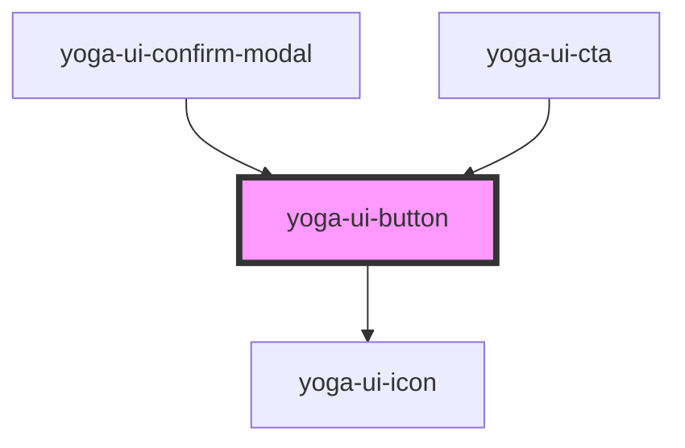

# yoga-ui-button

<!-- Auto Generated Below -->

## Properties

| Property    | Attribute    | Description                                                     | Type                                                                                                                                                             | Default     |
| ----------- | ------------ | --------------------------------------------------------------- | ---------------------------------------------------------------------------------------------------------------------------------------------------------------- | ----------- |
| `disabled`  | `disabled`   | If `true`, the button will be disabled. Defaults to `false`.    | `boolean`                                                                                                                                                        | `undefined` |
| `endIcon`   | `end-icon`   | Adds a svg icon at the end                                      | `"award" \| "calendar" \| "filter" \| "heartbeat" \| "layout" \| "lightning" \| "logo" \| "people" \| "plus" \| "stats" \| "training" \| "trainingIllustration"` | `undefined` |
| `iconSize`  | `icon-size`  | Set the size if the icon                                        | `string`                                                                                                                                                         | `undefined` |
| `startIcon` | `start-icon` | Adds a svg icon in front                                        | `"award" \| "calendar" \| "filter" \| "heartbeat" \| "layout" \| "lightning" \| "logo" \| "people" \| "plus" \| "stats" \| "training" \| "trainingIllustration"` | `undefined` |
| `variant`   | `variant`    | The button variant. primary or secondary. Defaults to `primary` | `string`                                                                                                                                                         | `"primary"` |

## Dependencies

### Used by

 - [yoga-ui-confirm-modal](../yoga-ui-confirm-modal)
 - [yoga-ui-cta](../yoga-ui-cta)

### Depends on

- [yoga-ui-icon](../yoga-ui-icon)

### Graph

----------------------------------------------

*Built with [StencilJS](https://stenciljs.com/)*
