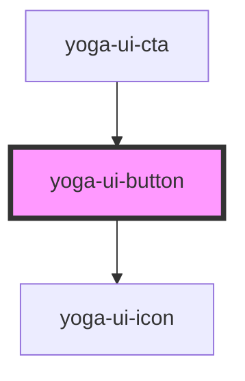

# yoga-ui-button

<!-- Auto Generated Below -->

## Properties

| Property    | Attribute    | Description | Type      | Default     |
| ----------- | ------------ | ----------- | --------- | ----------- |
| `disabled`  | `disabled`   |             | `boolean` | `undefined` |
| `endIcon`   | `end-icon`   |             | `string`  | `undefined` |
| `iconSize`  | `icon-size`  |             | `string`  | `undefined` |
| `startIcon` | `start-icon` |             | `string`  | `undefined` |
| `variant`   | `variant`    |             | `string`  | `"primary"` |

## Dependencies

### Used by

 - [yoga-ui-cta](../yoga-ui-cta)

### Depends on

- [yoga-ui-icon](../yoga-ui-icon)

### Graph

----------------------------------------------

*Built with [StencilJS](https://stenciljs.com/)*
