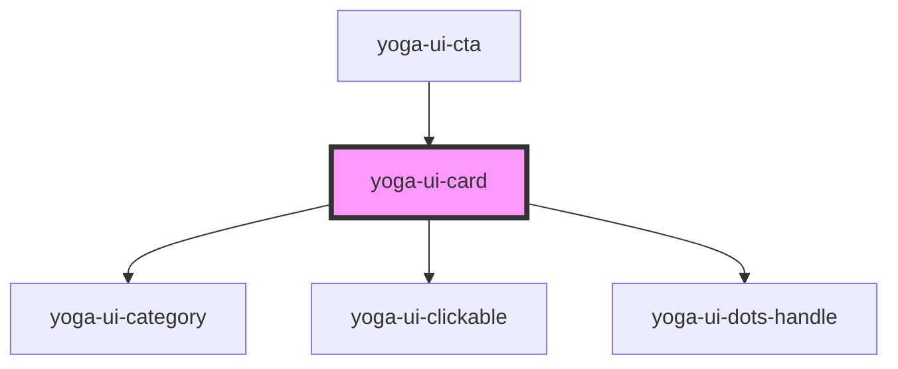

# yoga-ui-card

<!-- Auto Generated Below -->

## Properties

| Property    | Attribute    | Description                                                                    | Type      | Default     |
| ----------- | ------------ | ------------------------------------------------------------------------------ | --------- | ----------- |
| `category`  | `category`   | Adds a category                                                                | `string`  | `undefined` |
| `hasHandle` | `has-handle` | If `true`, it will show a dots-handle button on the right. Defaults to `false` | `boolean` | `undefined` |

## Events

| Event         | Description | Type               |
| ------------- | ----------- | ------------------ |
| `handleClick` |             | `CustomEvent<any>` |

## Dependencies

### Used by

 - [yoga-ui-cta](../yoga-ui-cta)

### Depends on

- [yoga-ui-category](../yoga-ui-category)
- [yoga-ui-clickable](../yoga-ui-clickable)
- [yoga-ui-dots-handle](../yoga-ui-dots-handle)

### Graph

----------------------------------------------

*Built with [StencilJS](https://stenciljs.com/)*
