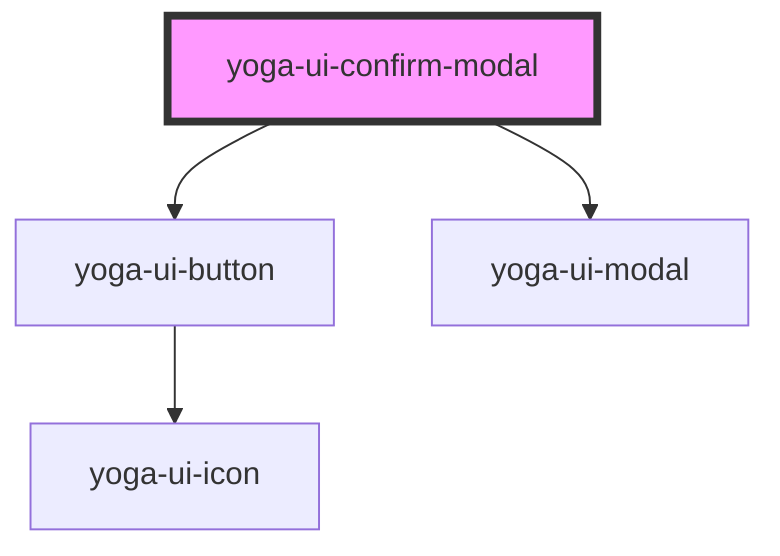

# yoga-ui-confirm-modal

<!-- Auto Generated Below -->

## Methods

### `close() => Promise<void>`

#### Returns

Type: `Promise<void>`

### `open() => Promise<void>`

#### Returns

Type: `Promise<void>`

## Dependencies

### Depends on

- [yoga-ui-button](../yoga-ui-button)
- [yoga-ui-modal](../yoga-ui-modal)

### Graph

----------------------------------------------

*Built with [StencilJS](https://stenciljs.com/)*
