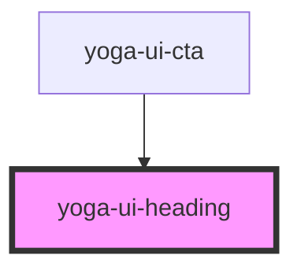

# yoga-ui-heading

<!-- Auto Generated Below -->

## Properties

| Property          | Attribute       | Description                                                                     | Type                                           | Default     |
| ----------------- | --------------- | ------------------------------------------------------------------------------- | ---------------------------------------------- | ----------- |
| `as` _(required)_ | `as`            | The element to use for the heading.                                             | `"h1" \| "h2" \| "h3" \| "h4" \| "h5" \| "h6"` | `undefined` |
| `centerMobile`    | `center-mobile` | Center the text on mobile                                                       | `boolean`                                      | `undefined` |
| `spaceBottom`     | `space-bottom`  | Add margin bottom to the heading.                                               | `number`                                       | `undefined` |
| `styleAs`         | `style-as`      | The style to use for the heading. Example: Style a h2 as a h1 by adding styleAs | `"h1" \| "h2" \| "h3" \| "h4" \| "h5" \| "h6"` | `undefined` |
| `variant`         | `variant`       | The heading variant. Example: medium, bold or dark                              | `string`                                       | `undefined` |

## Dependencies

### Used by

 - [yoga-ui-cta](../yoga-ui-cta)

### Graph

----------------------------------------------

*Built with [StencilJS](https://stenciljs.com/)*
