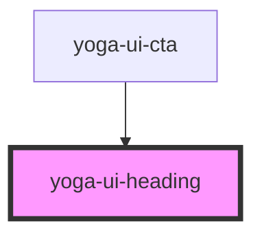

# yoga-ui-heading

<!-- Auto Generated Below -->

## Properties

| Property          | Attribute      | Description | Type                                           | Default     |
| ----------------- | -------------- | ----------- | ---------------------------------------------- | ----------- |
| `as` _(required)_ | `as`           |             | `"h1" \| "h2" \| "h3" \| "h4" \| "h5" \| "h6"` | `undefined` |
| `spaceBottom`     | `space-bottom` |             | `number`                                       | `undefined` |
| `styleAs`         | `style-as`     |             | `"h1" \| "h2" \| "h3" \| "h4" \| "h5" \| "h6"` | `undefined` |
| `variant`         | `variant`      |             | `string`                                       | `undefined` |

## Dependencies

### Used by

 - [yoga-ui-cta](../yoga-ui-cta)

### Graph

----------------------------------------------

*Built with [StencilJS](https://stenciljs.com/)*
