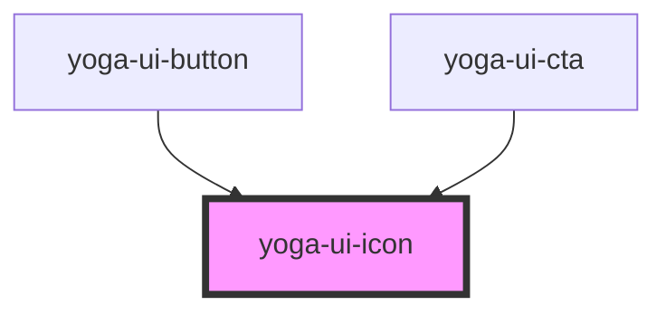

# yoga-ui-icon

<!-- Auto Generated Below -->

## Properties

| Property            | Attribute | Description                                                                                            | Type                                                                                                                                                             | Default     |
| ------------------- | --------- | ------------------------------------------------------------------------------------------------------ | ---------------------------------------------------------------------------------------------------------------------------------------------------------------- | ----------- |
| `color`             | `color`   | The icon color. Will render a modifier class, so if you send 'primary' it will become: `icon--primary` | `string`                                                                                                                                                         | `undefined` |
| `height`            | `height`  | The icon height                                                                                        | `string`                                                                                                                                                         | `undefined` |
| `icon` _(required)_ | `icon`    | The icon to render. For example `calendar`                                                             | `"award" \| "calendar" \| "filter" \| "heartbeat" \| "layout" \| "lightning" \| "logo" \| "people" \| "plus" \| "stats" \| "training" \| "trainingIllustration"` | `undefined` |
| `width`             | `width`   | The icon width                                                                                         | `string`                                                                                                                                                         | `undefined` |

## Dependencies

### Used by

 - [yoga-ui-button](../yoga-ui-button)
 - [yoga-ui-cta](../yoga-ui-cta)

### Graph

----------------------------------------------

*Built with [StencilJS](https://stenciljs.com/)*
