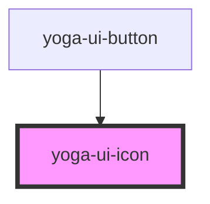

# yoga-ui-icon

<!-- Auto Generated Below -->

## Properties

| Property            | Attribute | Description | Type     | Default     |
| ------------------- | --------- | ----------- | -------- | ----------- |
| `height`            | `height`  |             | `string` | `undefined` |
| `icon` _(required)_ | `icon`    |             | `string` | `undefined` |
| `width`             | `width`   |             | `string` | `undefined` |

## Dependencies

### Used by

 - [yoga-ui-button](../yoga-ui-button)

### Graph

----------------------------------------------

*Built with [StencilJS](https://stenciljs.com/)*
