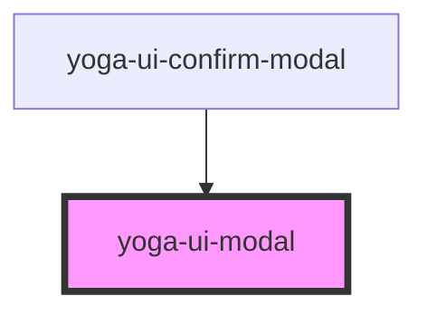

# yoga-ui-modal

<!-- Auto Generated Below -->

## Properties

| Property | Attribute | Description | Type      | Default |
| -------- | --------- | ----------- | --------- | ------- |
| `show`   | `show`    |             | `boolean` | `false` |

## Events

| Event         | Description | Type               |
| ------------- | ----------- | ------------------ |
| `modalClosed` |             | `CustomEvent<any>` |
| `modalOpened` |             | `CustomEvent<any>` |

## Methods

### `close() => Promise<void>`

#### Returns

Type: `Promise<void>`

### `open() => Promise<void>`

#### Returns

Type: `Promise<void>`

## Dependencies

### Used by

 - [yoga-ui-confirm-modal](../yoga-ui-confirm-modal)

### Graph

----------------------------------------------

*Built with [StencilJS](https://stenciljs.com/)*
