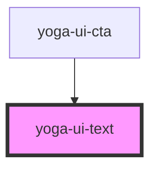

# yoga-ui-text

<!-- Auto Generated Below -->

## Properties

| Property       | Attribute       | Description                                                                                              | Type                                                                                                      | Default     |
| -------------- | --------------- | -------------------------------------------------------------------------------------------------------- | --------------------------------------------------------------------------------------------------------- | ----------- |
| `as`           | `as`            | The element to use for the text. Defaults to `span`                                                      | `"em" \| "h1" \| "h2" \| "h3" \| "h4" \| "h5" \| "h6" \| "label" \| "p" \| "small" \| "span" \| "strong"` | `"span"`    |
| `centerMobile` | `center-mobile` | Center the text on mobile                                                                                | `boolean`                                                                                                 | `undefined` |
| `styleAs`      | `style-as`      | The style to use for the text. Example: Style a p as a span by adding styleAs                            | `"em" \| "h1" \| "h2" \| "h3" \| "h4" \| "h5" \| "h6" \| "label" \| "p" \| "small" \| "span" \| "strong"` | `undefined` |
| `variant`      | `variant`       | The text variant. Will render a modifier class, so if you send 'primary' it will become: `text--primary` | `string`                                                                                                  | `undefined` |

## Dependencies

### Used by

 - [yoga-ui-cta](../yoga-ui-cta)

### Graph

----------------------------------------------

*Built with [StencilJS](https://stenciljs.com/)*
