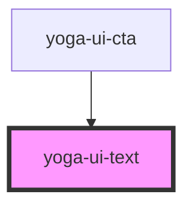

# yoga-ui-text

<!-- Auto Generated Below -->

## Properties

| Property  | Attribute  | Description | Type                                                                                                      | Default     |
| --------- | ---------- | ----------- | --------------------------------------------------------------------------------------------------------- | ----------- |
| `as`      | `as`       |             | `"em" \| "h1" \| "h2" \| "h3" \| "h4" \| "h5" \| "h6" \| "label" \| "p" \| "small" \| "span" \| "strong"` | `"span"`    |
| `styleAs` | `style-as` |             | `"em" \| "h1" \| "h2" \| "h3" \| "h4" \| "h5" \| "h6" \| "label" \| "p" \| "small" \| "span" \| "strong"` | `undefined` |
| `variant` | `variant`  |             | `string`                                                                                                  | `undefined` |

## Dependencies

### Used by

 - [yoga-ui-cta](../yoga-ui-cta)

### Graph

----------------------------------------------

*Built with [StencilJS](https://stenciljs.com/)*
